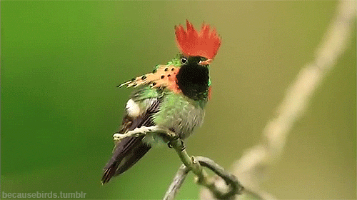
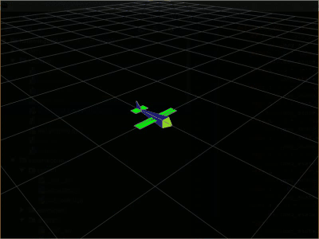
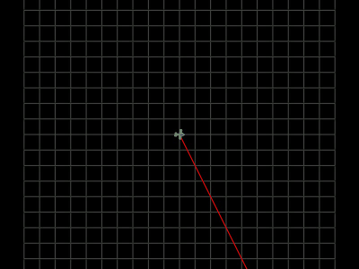

# Hummingbird
#

### Incentive

**hummingbird** aims to model fixedwind UAVs and allow their sizing / tuning.

### Credits

The project is initially forked from [mavsim_template_files](https://github.com/sethmnielsen/mavsim_template_files), 
completed by [sethmnielsen](https://github.com/sethmnielsen) and 
created by [Pr. R. Beard](https://github.com/randybeard) & Pr. T. McLain.
These previous templates are the counterpart of the book 
[Small UAV: Theory and Practice](https://press.princeton.edu/titles/9632.html) 
written by the same two professors.

I already completed the suggested template project in Matlab and in python (see [limbo](https://github.com/don4get/limbo)).
This new version will allow me to go further and test some features of OSS scientific libraries I am involved into 
([python-control](https://github.com/python-control/python-control), [sippy](https://github.com/CPCLAB-UNIPI/SIPPY)).

## Do you want more info?
Feel free to read the [wiki](https://github.com/don4get/hummingbird/wiki)

## Examples 

#### Kinematics

#### Open loop physics

#### Closed loop simulation

#### Data analysis

#### Path follower

#### Path manager

#### Path planner

