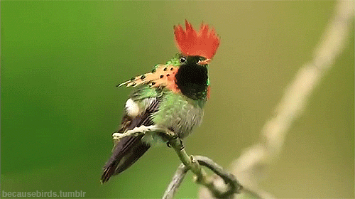

# Hummingbird

### Incentive

**hummingbird** aims to model fixedwind UAVs and allow their sizing / tuning.

### Credits

The project is initially forked from [mavsim_template_files](https://github.com/sethmnielsen/mavsim_template_files), 
completed by [sethmnielsen](https://github.com/sethmnielsen) and 
created by [Pr. R. Beard](https://github.com/randybeard) & Pr. T. McLain.
These previous templates are the counterpart of the book 
[Small UAV: Theory and Practice](https://press.princeton.edu/titles/9632.html) 
written by the same two professors.
