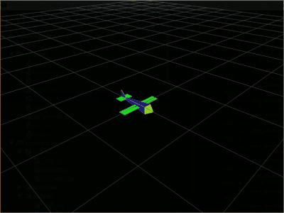

.. hummingbird documentation master file, created by
   sphinx-quickstart on Sat Jul 13 11:38:29 2019.
   You can adapt this file completely to your liking, but it should at least
   contain the root `toctree` directive.

Welcome to hummingbird's docs
=============================

.. meta::
   :description lang=en: Discover how to size and tuning your next fixed wing uav.

`hummingbird`_ highlights how sizing and tuning of a fixedwing UAV has become
thanks to recents publications on the subject. 

Many thanks to Pr. R. Beard and Pr. T. McLain, who published `Small UAV Theory and practice`_.

**Learn the main principles to control a fixedwing**
    Through out this documentation, you will learn why and 
    how a small UAV is flying.

**Run simple examples to get familiar with your favorite bird**
    hummingbird comes with short scripts which can be run to analyse
    fixedwing detailed behavior.

**And many other features incoming**
    RC piloting, hands on system identification, introduction to MIMO control, etc.

.. _hummingbird: https://github.com/don4get/hummingbird
.. _Small UAV Theory and practice: https://press.princeton.edu/titles/9632.html

First steps
-----------

**Getting started**:
    * Install recent python version: `download python`_
    * :code:`git clone https://github.com/don4get/hummingbird.git`
    * :code:`cd hummingbird`
    * :code:`pip install virtualenv`
    * :code:`virtualenv hummingbird-venv`
    * :code:`source hummingbird-venv/bin/activate` on Mac OS / Linux, :code:`hummingbird\Scripts\activate` on Windows 
    * :code:`pip install -r requirements.txt`
    * :code:`python mavsim_chap12.py`

.. _download python: https://www.python.org/downloads/

Examples
--------

**Kinematics**

**Open loop physics**

.. image:: ../../examples/physics.gif
   :alt: Image not found

**Closed loop simulation**

.. image:: ../../examples/autopilot.gif
   :alt: Image not found

**Data analysis**

.. image:: ../../examples/observer.gif
   :alt: Image not found

**Path follower**

.. image:: ../../examples/path_follower_line.gif
   :alt: Image not found

.. image:: ../../examples/path_follower_orbit.gif
   :alt: Image not found

**Path manager**

.. image:: ../../examples/path_manager.gif
   :alt: Image not found

**Path planner**

.. image:: ../../examples/path_planner.gif
   :alt: Image not found

